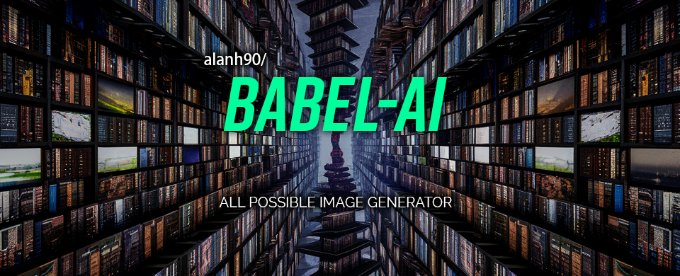
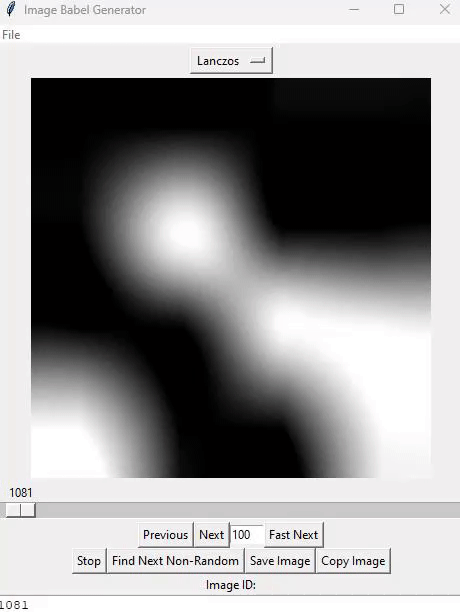

# Babel AI - All Possible Image Generation and Analysis


## Introduction
Babel AI is a Python-based project that delves into the fascinating realm of generating all conceivable images within specific parameters such as pixel size, color depth, and options for black and white or color. It features a user-friendly graphical interface to seamlessly visualize the generated images. Additionally, it empowers users to import existing images to ascertain their unique position within the comprehensive library of all potential images.



## Features
- Generate a myriad of images based on user-defined parameters like pixel size and color depth.
- Effortlessly navigate through the generated images using an intuitive slider and navigation buttons.
- Import and pinpoint the ID of existing images within the global image library.
- Exclude images resembling random noise beyond a set threshold to ensure quality and relevance.
- Employ advanced mathematical techniques to analyze and contrast images, unveiling underlying patterns and similarities.
- Save generated images to the user's computer or copy them to the clipboard for easy sharing.
- Customize the image resampling filter for enhanced visual quality.
- View the current image ID and position within the library of all possible images.
- 
## Installation

### Prerequisites
- Python 3.x
- pip (Python package installer)

### Clone the repository
```bash
git clone https://github.com/yourusername/babel-ai.git
